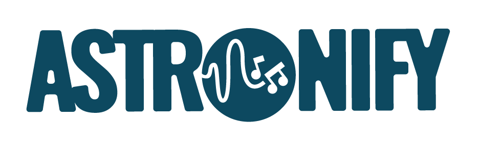

Sonification of astronomical data.
----------------------------------

.. image:: http://img.shields.io/badge/powered%20by-AstroPy-orange.svg?style=flat
    :target: http://www.astropy.org
    :alt: Powered by Astropy Badge

.. image:: https://badge.fury.io/py/astronify.svg
    :target: https://badge.fury.io/py/astronify 
    :alt: PyPi Status
          
.. image:: https://readthedocs.org/projects/astronify/badge/?version=latest
    :target: https://astronify.readthedocs.io/en/latest/?badge=latest
    :alt: Documentation Status

.. image:: https://img.shields.io/badge/ascl-2408.005-blue.svg?colorB=262255
    :target: https://ascl.net/2408.005
    :alt: ascl:2408.005
    
Tools for sonifying astronomical data.

This package is currently in the very beginning stages and is under active development to
include sonification of time series data, specifically light curves. 

Project Status
--------------

.. image:: https://github.com/spacetelescope/astronify/workflows/CI/badge.svg
    :target: https://github.com/spacetelescope/astronify/actions
    :alt: Astronify's GitHub Actions CI Status
    
.. image:: https://codecov.io/gh/spacetelescope/astronify/branch/main/graph/badge.svg
  :target: https://codecov.io/gh/spacetelescope/astronify
  :alt: Astronify's Codecov coverage status

Getting Started
---------------
[Install Instructions](docs/astronify/install.rst)

[Tutorials](docs/notebooks/Intro_Astronify_Series.ipynb)

Contributing
------------

If you are a maintainer of the code, refer to the [developer
documentation](DEVELOPER_DOC.rst) for guidelines on how to release a
new version.

We love contributions! Astronify is open source,
built on open source, and we'd love to have you hang out in our community.

**Imposter syndrome disclaimer**: We want your help. No, really.

There may be a little voice inside your head that is telling you that you're not
ready to be an open source contributor; that your skills aren't nearly good
enough to contribute. What could you possibly offer a project like this one?

We assure you - the little voice in your head is wrong. If you can write code at
all, you can contribute code to open source. Contributing to open source
projects is a fantastic way to advance one's coding skills. Writing perfect code
isn't the measure of a good developer (that would disqualify all of us!); it's
trying to create something, making mistakes, and learning from those
mistakes. That's how we all improve, and we are happy to help others learn.

Being an open source contributor doesn't just mean writing code either. You can
help out by writing documentation, tests, or even giving feedback about the
project (and yes - that includes giving feedback about the contribution
process). Some of these contributions may be the most valuable to the project as
a whole, because you're coming to the project with fresh eyes, so you can see
the errors and assumptions that seasoned contributors have glossed over.

Note: This disclaimer was originally written by
`Adrienne Lowe <https://github.com/adriennefriend>`_ for a
`PyCon talk <https://www.youtube.com/watch?v=6Uj746j9Heo>`_, and was adapted by
Astronify based on its use in the README file for the
`MetPy project <https://github.com/Unidata/MetPy>`_.

License
-------

This project is Copyright (c) Clara Brasseur, Scott Fleming, Jennifer Kotler, Kate Meredith and licensed under
the terms of the BSD 3-Clause license. This package is based upon
the `Astropy package template <https://github.com/astropy/package-template>`_
which is licensed under the BSD 3-clause licence. See the licenses folder for
more information.

