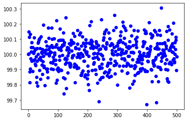
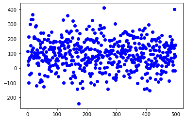
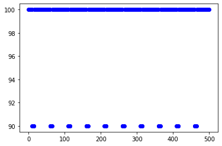
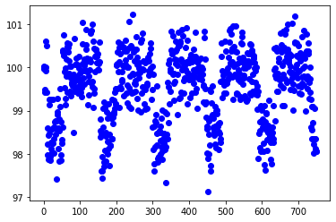
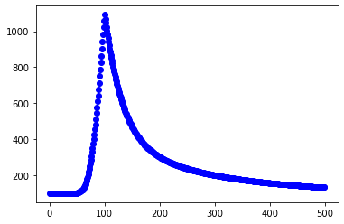

Simulating Light Curves
=======================

.. code:: python

    from astropy.io import fits
    from astropy.table import Table
    
    from astronify import simulator, series

.. parsed-literal::

    
    WxPython is not found for the current python version.
    Pyo will use a minimal GUI toolkit written with Tkinter (if available).
    This toolkit has limited functionnalities and is no more
    maintained or updated. If you want to use all of pyo's
    GUI features, you should install WxPython, available here:
    http://www.wxpython.org/
    

Let’s start off with a simulated light curve that has almost no
variation at all, to orient ourselves. We’ll use the simulator to create
a “flat” light curve with almost zero noise (specified via the noise
parameter). The length parameter specifies how long we want our light
curve to be. Setting visualize to True means a plot will be made showing
the fluxes (brightness) as a function of time. The yoffset parameter is
used to specify the baseline brightness level.

.. code:: python

    lc_data = simulator.simulated_lc("flat", lc_length=500, lc_noise=0.1, visualize=True, lc_yoffset=100.)

Now let’s create a sonified version of the data!

.. code:: python

    soni_obj = series.SoniSeries(lc_data)
    soni_obj.sonify()

And now let’s listen to the sound!

.. code:: python

    soni_obj.play()

.. parsed-literal::

    Pyo warning: Portaudio input device `Display Audio` has fewer channels (1) than requested (2).
    Pyo warning: Portmidi warning: no midi device found!
    Portmidi closed.

You can inject different amounts of noise. Let’s make a light curve with
a lot of noise. In our first example, we used a value of 0.1 for the
noise parameter. Now we’ll make a light curve with 1000 times the level
of noise.

.. code:: python

    lc_data = simulator.simulated_lc("flat", lc_length=500, lc_noise=100., visualize=True, lc_yoffset=100.)

Let’s sonify this light curve and listen to it.

.. code:: python

    soni_obj = series.SoniSeries(lc_data)
    soni_obj.sonify()
    soni_obj.play()

.. parsed-literal::

    Pyo warning: Portaudio input device `Display Audio` has fewer channels (1) than requested (2).
    Pyo warning: Portmidi warning: no midi device found!
    Portmidi closed.

You can also use the simulator to inject signals of different types.
Let’s inject a signal expected from a transiting extrasolar planet. For
now, we will use all the defaults for the parameters.

.. code:: python

    lc_data = simulator.simulated_lc("transit", visualize=True)

Let’s sonify this light curve and see if we can hear the drop in
brightness caused by the planet blocking a very small part of the star’s
surface when it passes in front of the star.

.. code:: python

    soni_obj = series.SoniSeries(lc_data)
    soni_obj.pitch_mapper.pitch_map_args["pitch_range"] = [440,880]
    soni_obj.sonify()
    soni_obj.play()

.. parsed-literal::

    Pyo warning: Portaudio input device `Display Audio` has fewer channels (1) than requested (2).
    Pyo warning: Portmidi warning: no midi device found!
    Portmidi closed.

Now let’s explore the options when adding a transiting extrasolar planet
signal. We will specify the depth of the transit (how much the planet
blocks), the period (how long it takes the planet to make one full pass
around the star), and the width (how long the planet takes to cross the
star’s surface). We’ll also add some noise to the light curve, and
finally ask for a slightly longer light curve so we can get more
opportunities to have the planet cross in front of the star.

.. code:: python

    lc_data = simulator.simulated_lc("transit", visualize=True, transit_depth=1.5, transit_period=145,
                                     transit_width=42, lc_noise=0.5, lc_length=750)

Let’s sonify this light curve!

.. code:: python

    soni_obj = series.SoniSeries(lc_data)
    soni_obj.sonify()
    soni_obj.play()

.. parsed-literal::

    Pyo warning: Portaudio input device `Display Audio` has fewer channels (1) than requested (2).
    Pyo warning: Portmidi warning: no midi device found!
    Portmidi closed.

You can also add sinusoidal signals to the data. Let’s create a light
curve like this using the default parameters.

.. code:: python

    lc_data = simulator.simulated_lc("sine", visualize=True)

.. image:: How_To_Use_The_Simulator_files/How_To_Use_The_Simulator_20_0.png

Let’s sonify this light curve and listen to it.

.. code:: python

    soni_obj = series.SoniSeries(lc_data)
    soni_obj.sonify()
    soni_obj.play()

.. parsed-literal::

    Pyo warning: Portaudio input device `Display Audio` has fewer channels (1) than requested (2).
    Pyo warning: Portmidi warning: no midi device found!
    Portmidi closed.

Now let’s make a sinusoidal signal and use some of the parameter
options. We will change the amplitude (how “big” the curve is from top
to bottom), and the period (how long it takes to make one full cycle
from peak to bottom and back to peak again). We’ll also add a little
noise to the light curve, and ask for a light curve that lasts twice as
long as the default.

.. code:: python

    lc_data = simulator.simulated_lc("sine", visualize=True, sine_amp=1.5, sine_period=142, lc_noise=0.5, lc_length=1000)

Let’s sonify this.

.. code:: python

    soni_obj = series.SoniSeries(lc_data)
    soni_obj.sonify()
    soni_obj.play()

.. parsed-literal::

    Pyo warning: Portaudio input device `Display Audio` has fewer channels (1) than requested (2).
    Pyo warning: Portmidi warning: no midi device found!
    Portmidi closed.

If you would like to save a light curve you create with the simulator to
a file for use later, you can specify an output file name and a FITS
file will be created that will store the parameters you used to create
the light curve, as well as the times, fluxes, and fluxes without noise
added. Let’s do that now using the call above (and we won’t ask for a
plot this time). Note: because noise is added randomly, it won’t be
exactly the same as the one above, but will be close enough.

.. code:: python

    lc_data = simulator.simulated_lc("sine", lc_ofile="sim_lc_sine.fits", visualize=False, sine_amp=1.5, sine_period=142,
                                     lc_noise=0.5, lc_length=1000)

