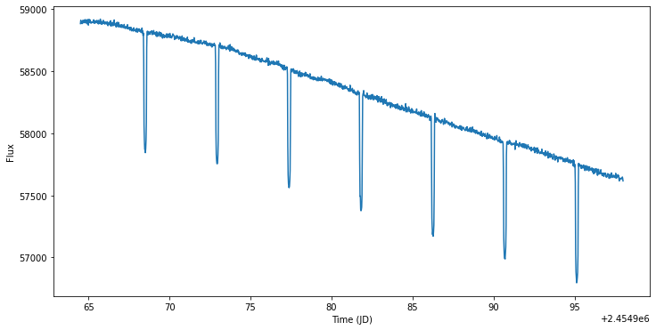

Astronify: Sonifying Time Series
================================

This tutorial will demonstrate the sonification of time series data,
specifically light curves using Astronify. It will cover basic usage,
adjusting sonification parameters, playing the sonification within the
browser, and saving the sonification as a wav file.

1. `Imports`_
2. `Getting data`_
3. `Basic sonification`_
4. `Changing sonification parameters`_
5. `Outputing an audio file`_

Imports
-------

In addition to Astronify, we will use the
`Lightkurve <https://docs.lightkurve.org/>`__ package to query and
download Kepler light curves, `matplotlib <https://matplotlib.org/>`__
to plot the light curves (these cells will be markes and can be skipped
by those for whom plots are not useful), and
`Astropy <https://www.astropy.org/>`__ for various data manipulation
tasks.

\* Don't worry if you get a warning about WxPython not being found,
it's used for the GUI functionality audio library, which Astronify does
not use.

.. code:: python

    >>> from astronify.series import SoniSeries
    >>> import lightkurve
    
    >>> import matplotlib    
    >>> import matplotlib.pyplot as plt
    

Getting data
------------

Fundamentally all that Astronify requires is an Astropy Table object
where one colum will be translated into time (default is “time”) and one
column will be translated into pitch (default is “flux”).

Simply because it is easy I will download a Kepler light curve using
lightkurve (lightkurve is a user friendly way to get Kepler and TESS
data). This is a light curve that shows Kepler 12b, a transiting
exoplanet.

.. code:: python

    >>> kep12b_lc = lightkurve.search_lightcurvefile("KIC 11804465", cadence="long", quarter=1).download_all()[0].SAP_FLUX.to_table()

Basic sonification
------------------

Here we will use all of the sonification defaults and see what we get.

First a small peak at the data visually for those of us who find that
useful.

.. code:: python

    >>> f, ax = plt.subplots(figsize=(12, 6))
    >>> ax.plot(kep12b_lc['time'].jd, kep12b_lc['flux'])
    >>> ax.set_xlabel("Time (JD)")
    >>> ax.set_ylabel("Flux")
            
    >>> plt.show()

Now to sonify the same data.

.. code:: python

    >>> kep12b_obj = SoniSeries(kep12b_lc)
    >>> kep12b_obj.sonify()

And play the sonification.

.. code:: python

    >>> kep12b_obj.play()

The playback will stop at the end, but we can also stop it early.

.. code:: python

    >>> kep12b_obj.stop()

Changing sonification parameters
--------------------------------

Let’s look at the current sonification parameters.

.. code:: python

    >>> kep12b_obj.pitch_mapper.pitch_map_args
    {'pitch_range': [100, 10000],
     'center_pitch': 440,
     'zero_point': 'median',
     'stretch': 'linear'}

We can change all of these default arguments as well as adding any
additional arguments allowed by the pitch mapping function.

Changing the center pitch
~~~~~~~~~~~~~~~~~~~~~~~~~

.. code:: python

    >>> kep12b_obj.pitch_mapper.pitch_map_args["center_pitch"] = 880
    
    >>> kep12b_obj.sonify()
    >>> kep12b_obj.play()

.. code:: python

    >>> kep12b_obj.stop()
    
    >>> kep12b_obj.pitch_mapper.pitch_map_args["center_pitch"] = 440

Changing the stretch to logarithmic
~~~~~~~~~~~~~~~~~~~~~~~~~~~~~~~~~~~

.. code:: python

    >>> kep12b_obj.pitch_mapper.pitch_map_args["stretch"] = "log"
    
    >>> kep12b_obj.sonify()
    >>> kep12b_obj.play()

.. code:: python

    >>> kep12b_obj.stop()
    
    >>> kep12b_obj.pitch_mapper.pitch_map_args["stretch"] = "linear"

Removing the outer 1% of data points
~~~~~~~~~~~~~~~~~~~~~~~~~~~~~~~~~~~~

.. code:: python

    >>> kep12b_obj.pitch_mapper.pitch_map_args["minmax_percent"] = [0.5, 99.5]
    
    >>> kep12b_obj.sonify()
    >>> kep12b_obj.play()

.. code:: python

    >>> kep12b_obj.stop()
    
    >>> del kep12b_obj.pitch_mapper.pitch_map_args["minmax_percent"]

Outputing an audio file
-----------------------

Once the sonification sounds the way we like we can output the result to
a wav file.

.. code:: python

    >>> kep12b_obj.write("kepler_12b.wav")
    Pyo message: Offline Server rendering file kepler_12b.wav dur=16.879996
    Pyo message: Offline Server rendering finished.

`Kepler 12b audio file <../_static/kepler_12b.wav>`_

.. raw:: html

    <audio controls="controls">
      <source src="../_static/kepler_12b.wav" type="audio/wav">
      Your browser does not support the <code>audio</code> element. 
    </audio>

